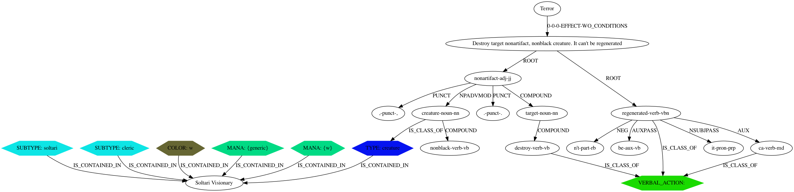

# MTG Deck Builder

## Quick INSTALL AND RUN guide:
>pip install poetry  
>poetry install  
>python -m spacy download en_core_web_sm

Then, please install postgres locally (and run it on port 5432) and create a database 'mtg' owned by an user 'mtg' with password 'mtg'.
This is to run parts of the code more efficiently.

Also, you should install graphviz (sudo apt-get install graphiz or brew install graphviz). It will be necessary down the road.

Now, to actually run the data processing flows:
> python prefect_flows.py

Sit back and relax, this is gonna take a while (around 3hr, I'd say). 

And, if you want to see a simplfied MVP of what a final product would look like, run
> streamlit run 04c_ga_for_deck_building.py 

and open your browser on http://localhost:8501/.

## Ideal
The ideal of this project is to, given two sets of cards and a format, return you the best deck you could build for that format with the first set of cards, to play against a deck built from the second set of cards. Remember: ideal is not a goal (and best deck would be a very disputable term for MTG anyway, specially after [this paper](https://arxiv.org/abs/1904.09828)). As Eduardo Galeano said, ideal is like the horizon, it is a direction for us to walk towards, but never to reach.

## Method

We could get info from the meta game and build decks from meta cards. Or we could (somehow) get decks victory stats and learn the best cards from that.
Both approaches are valid and would profit from all the human learning in this arena.

But the approach proposed here is slightly different, the idea is to make the engine to reason more from cards relations than from human usage.
So, it tries to build features from cards relations, inferred by their text, properties and games rules; and learn some mapping from these features to a ranking of goodness of a deck. This ranking may be learned from meta game or decks stats and history, but than the knowledge acquired by the model would be able to generalize to new cards and sets.

### Building blocks

Establishing relationships between cards starts by applying NLP to individual cards and identifying mentioned entites:

And on the other side, detecting entites partaining to cards:

Joining the graphs would result in a path (a established relation) between the two cards:

Actually, it describes the relation 'Terror' -> 'Soltari Visionary'. The inverse relation would look different.

Joining on the in and out graphs of all cards in a deck would result in the decks relationship graph. That's where we want to extract our features from.
This is still ongoing work (help is welcome and appreciated, I would love to discuss ideias). A simplified collased "deck relations graph" could look like this:

Files 04a and 04b outline a few other ideas (not yet implemented).

You can also read more about the NLP processing [here](https://magictganalysis.wixsite.com/home/post/down-the-rabbit-hole). This page algo contains a dashboard for exploring some of the generated datasets applied to a few decks.

### Next steps

#### Fitness of a deck

GOAL: get a fitness rank for a given deck.

There is a simplified genetic algorithm implemented optimizing a deck from a set of cards for a given measure of fitness (check the [streamlit run](#streamlitrun) part of INSTALL AND RUN). One possible next step would be to model this fitness index based on the NLP analysis already done.

The fitness would be a function of:
1. Static attributes: some aggregated measure of individual cards static attributes (card type, power, toughness, etc.)
1. Sinergy: some measure of how cards in the deck relate to each other  
1. Antergy: some measure of how cards in the deck relate to a second set of cards (which may be a specific deck)

Sinergy features could be built from the "deck relations graph".

Antergy features could be built from a graph built from the deck to the opposite set of cards (TBD).

Lastly, we can come up with some heuristics mapping these features to a fitness measure. But that is probably very hard to do and would have a very small chance of success (being able to measure if a deck is better/stronger than another).

The alternative is to find some measure of deck fitness available out there. For example, we could use win rate from [untapped.gg](https://mtga.untapped.gg/meta/tierlist) or data from [mtgatool](https://mtgatool.com/) or [mtgarena.pro](https://mtgarena.pro/meta/archetypes#rank-28;sort-W;archetype-34) or [mtgmeta](https://mtgmeta.io/metagame) (this one has an [API](https://mtgmeta.io/docs#apimetagame) for patreon members) as a target for fitting a model with the features above. Provided that we find an adequate model, we could apply the genetic algo to improve decks based on this calculated fitness.

### Some to do's, for interested people (including myself)

1. Find and gather data on decks stats (victories, etc.) -> This can help building a target for a fitness model  
  a. Scrape [untapped.gg](https://mtga.untapped.gg/meta/tierlist)  
1. Find, gather and explore data on meta game and how it evolved with time, for different formats. -> This can bring insights about how the importance of our features evolve over time (if they do) and may allow us to relativize features for our models  
1. Engineer features from the decks graph. -> aka. build sinergy and antergy features  
1. Engineer individual cards features. -> aka. build static features  
1. Build fitness model from meta game and deck stats
1. Add modelled fitness to genetic optimizer

